R Notebook
================

Introduction :

L’eau potable est considérée comme sûre pour la consommation humaine, mais elle n’est pas totalement exempte de micro-organismes. Les réseaux de distribution d’eau peuvent héberger des communautés microbiennes complexes, incluant des bactéries environnementales et des pathogènes opportunistes. Les méthodes classiques basées sur la culture ne permettent pas de détecter l’ensemble de cette diversité. L’article étudié s’inscrit donc dans le contexte de la surveillance microbiologique de l’eau potable à l’aide du métabarcoding du gène 16S rRNA, combiné à une approche de science participative en Chine. L’objectif est de décrire la diversité microbienne totale et d’évaluer la présence de pathogènes d’origine hydrique dans l’eau domestique.
#Problématique de l’article (INTRODUCTION)

Question scientifique principale de l’article :

Comment caractériser la composition globale des communautés microbiennes et la présence de pathogènes d’origine hydrique dans l’eau potable domestique en Chine, à grande échelle ?

Matériels et Méthodes :

Les échantillons d’eau ont été collectés par des volontaires dans différents foyers en chine , puis soumis à une extraction d’ADN suivie d’un séquençage Illumina paired-end ciblant le gène 16S rRNA. Les données de séquençage ont été traitées à l’aide du pipeline bioinformatique DADA2, qui permet un filtrage rigoureux des reads, l’apprentissage d’un modèle d’erreur, le débruitage des séquences et la génération de variantes de séquences exactes (ASV). Les reads forward et reverse ont ensuite été fusionnés, puis les séquences chimériques ont été éliminées. Une assignation taxonomique a été réalisée à l’aide de la base de données SILVA. Les analyses écologiques ont été conduites avec le package phyloseq afin d’évaluer la diversité alpha, la diversité beta et la composition taxonomique des communautés microbiennes.

Cette première commande sert à charger le package DADA2 et vérifier sa version (utile pour la reproductibilité des résultats) — ici, c’est la version 1.28.0.

```{r}
library(dada2)
packageVersion("dada2")
```


Cette commande sert à pointer vers le répertoire qui contient les fichiers FASTQ.La commande list.files(path) sert à afficher la liste des fichiers qui se trouvent dans le dossier (ARTICLE) indiqué par path.

```{r}
path <- "~/ARTICLE"
list.files(path)
```

On liste les fichiers R1 (forward) et R2 (reverse) avec list.files()
puis on extrait le nom d’échantillon (ex. “F3D0”) du nom complet du fichier FASTQ grâce à la fonction sapply(strsplit(…), `[`, 1).

```{r}
fnFs <- sort(list.files(path, pattern="_1.fastq", full.names = TRUE))
fnRs <- sort(list.files(path, pattern="_2.fastq", full.names = TRUE))
# Extract sample names, assuming filenames have format: SAMPLENAME_XXX.fastq
sample.names <- sapply(strsplit(basename(fnFs), "_1.fastq"), `[`, 1)
sample.names <- sapply(strsplit(basename(fnRs), "_2.fastq"), `[`, 1)
```

Qualité des données et traitement bioinformatique :
Les profils de qualité des reads montrent une bonne qualité globale au début des séquences, suivie d’une diminution progressive des scores de qualité vers la fin, plus marquée pour les reads reverse. Ces observations justifient les paramètres de troncature choisis lors de l’étape de filtrage. Les graphiques du modèle d’erreur montrent une bonne concordance entre les erreurs observées et prédites, indiquant que le modèle appris par DADA2 est adapté aux données. Le suivi des reads à chaque étape du pipeline révèle une perte progressive mais attendue des séquences, avec une proportion finale satisfaisante de reads non chimériques.

Commande pour tracer un graphique(un plot) qui montre la diminution des scores de qualité le long des séquences. afin de repérer où la qualité baisse et décider jusqu’où couper les bases peu fiables.


```{r}
plotQualityProfile(fnFs[1:2])
```

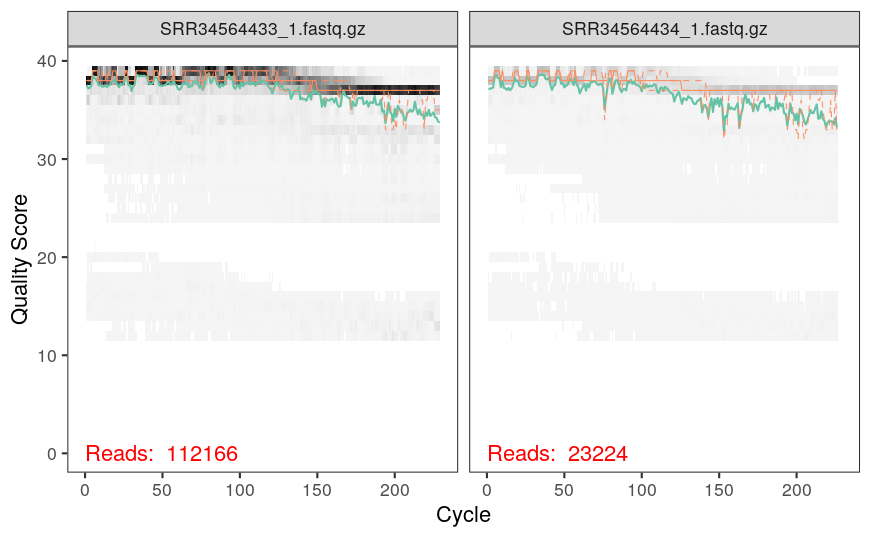

Commande pour tracer un graphique(un plot) qui montre la diminution des scores de qualité le long des séquences. afin de repérer où la qualité baisse et décider jusqu’où couper les bases peu fiables.


```{r}
plotQualityProfile(fnRs[1:2])
```

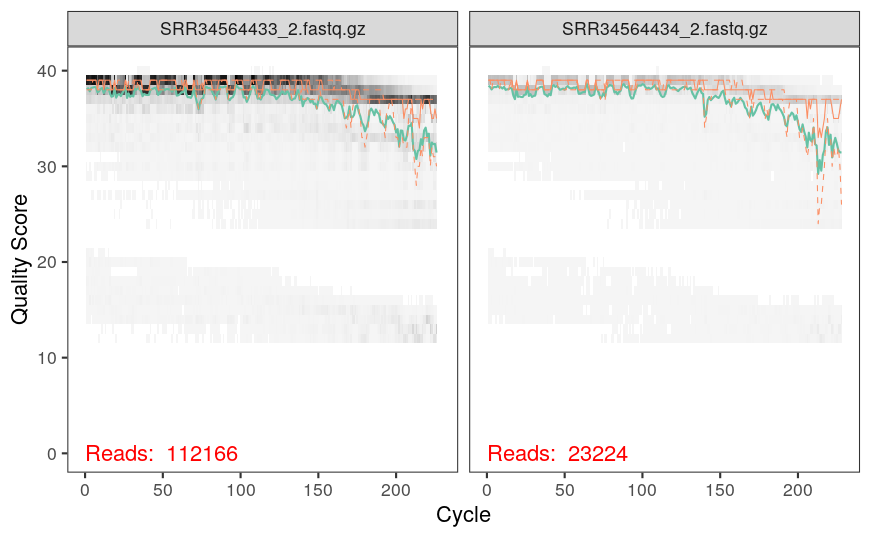

Définir les chemins de sortie pour les fastq filtrés.

```{r}
#Place filtered files in filtered/ subdirectory
filtFs <- file.path(path, "filtered", paste0(sample.names, "_1.fastq.gz"))
filtRs <- file.path(path, "filtered", paste0(sample.names, "_2.fastq.gz"))
names(filtFs) <- sample.names
names(filtRs) <- sample.names
```

Nettoie les fichiers FASTQ : coupe les lectures à 240/160 bases, enlève celles de mauvaise qualité (trop d’erreurs, bases inconnues, séquences PhiX) et enregistre les lectures filtrées.

 
```{r}
out <- filterAndTrim(fnFs, filtFs, fnRs, filtRs, truncLen=c(220,160),
              maxN=0, maxEE=c(2,2), truncQ=2, rm.phix=TRUE,
              compress=TRUE, multithread=FALSE) 
head(out)
```

                       reads.in reads.out
SRR34564433_1.fastq.gz   112166    112166
SRR34564434_1.fastq.gz    23224     23224
SRR34564435_1.fastq.gz    27466     27466
SRR34564436_1.fastq.gz    82807     82807
SRR34564437_1.fastq.gz    22389     22389
SRR34564438_1.fastq.gz   120638    120638

création d’un modèle d’erreur à partir des fichiers filtrés (forward )pour estimer la probabilité d’erreurs de séquençage selon la qualité

```{r}
errF <- learnErrors(filtFs, multithread=TRUE)
```


105274180 total bases in 478519 reads from 7 samples will be used for learning the error rates.


création d’un modèle d’erreur à partir des fichiers filtrés (reverse )pour estimer la probabilité d’erreurs de séquençage selon la qualité

```{r}
errR <- learnErrors(filtRs, multithread=TRUE)
```

Afficher un graphique des taux d’erreur observés vs prévus pour vérifier que le modèle d’erreur appris correspond bien aux données.

```{r}
plotErrors(errF, nominalQ=TRUE)
```

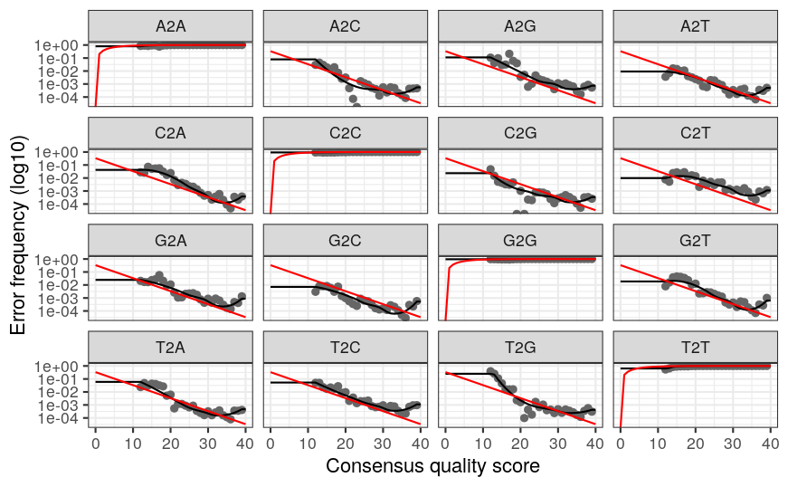

Afficher un graphique des taux d’erreur observés vs prévus pour vérifier que le modèle d’erreur appris correspond bien aux données.


```{r}
plotErrors(errR, nominalQ=TRUE)
```

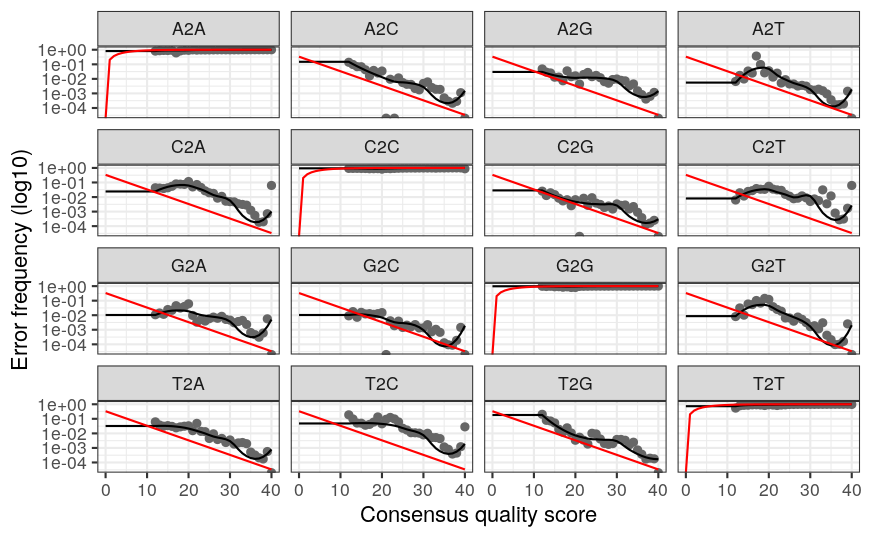

Débruite les lectures filtrées avec le modèle d’erreur pour identifier les vraies variantes (ASV),puis affiche le résultat du premier échantillon pour voir combien de variantes ont été détectées(Forward).

```{r}
dadaFs <- dada(filtFs, err=errF, multithread=TRUE)
```

Débruite les lectures filtrées avec le modèle d’erreur pour identifier les vraies variantes (ASV),puis affiche le résultat du premier échantillon pour voir combien de variantes ont été détectées(Reverse).

```{r}
dadaRs <- dada(filtRs, err=errR, multithread=TRUE)
```

Fusionner les reads forward et reverse pour reconstruire les séquences complètes

```{r}
mergers <- mergePairs(dadaFs, filtFs, dadaRs, filtRs, verbose=TRUE)
# Inspect the merger data.frame from the first sample
head(mergers[[1]])
```

Cette étape construit la table ASV à partir des séquences fusionnées : chaque ligne représente un échantillon,
chaque colonne correspond à une séquence ASV unique, et chaque valeur indique le nombre de reads observés pour
cette séquence dans l’échantillon, ce qui constitue la base des analyses écologiques et taxonomiques ultérieures.

```{r}
seqtab <- makeSequenceTable(mergers)
dim(seqtab)
```

Cette étape permet d’examiner la distribution des longueurs des séquences ASV obtenues après fusion,
afin de vérifier leur cohérence biologique et de détecter d’éventuelles séquences aberrantes ou mal fusionnées.

```{r}
# Inspect distribution of sequence lengths
table(nchar(getSequences(seqtab)))
```

Cette commande supprime les séquences chimériques issues d’artefacts de PCR en utilisant une approche consensus,
ce qui permet de conserver uniquement les séquences biologiquement plausibles pour les analyses ultérieures.

```{r}
seqtab.nochim <- removeBimeraDenovo(seqtab, method="consensus", multithread=TRUE, verbose=TRUE)
dim(seqtab.nochim)
```

Cette ligne calcule la proportion de reads conservés après l’élimination des chimères,
 fournissant un indicateur global de la qualité du jeu de données après nettoyage.

```{r}
sum(seqtab.nochim)/sum(seqtab)
```

```{r}

## Cette fonction utilitaire permet de calculer le nombre total de reads uniques dans un objet DADA2,
# ce qui est utilisé pour suivre l’évolution des données tout au long du pipeline.
getN <- function(x) sum(getUniques(x))
# Cette étape compile, pour chaque échantillon, le nombre de reads conservés à chaque étape du traitement
# (filtrage, débruitage, fusion et suppression des chimères), afin d’évaluer les pertes et la robustesse du pipeline.

track <- cbind(out, sapply(dadaFs, getN), sapply(dadaRs, getN), sapply(mergers, getN), rowSums(seqtab.nochim))
# If processing a single sample, remove the sapply calls: e.g. replace sapply(dadaFs, getN) with getN(dadaFs)
colnames(track) <- c("input", "filtered", "denoisedF", "denoisedR", "merged", "nonchim")
rownames(track) <- sample.names
head(track)
```

Cette étape assigne une taxonomie aux ASV non chimériques à l’aide de la base de données SILVA,
en classant chaque séquence jusqu’au niveau du genre lorsque l’information est disponible.

```{r}
taxa <- assignTaxonomy(seqtab.nochim, "~/ARTICLE/silva_nr99_v138.2_toGenus_trainset.fa.gz?download=1", multithread=TRUE)
```

Cette commande tente d’affiner l’annotation taxonomique en ajoutant le niveau espèce,
 lorsque la séquence ASV correspond suffisamment bien à une référence de la base SILVA.

```{r}
taxa <- addSpecies(taxa, "~/ARTICLE/silva_v138.2_assignSpecies.fa.gz?download=1")
```

Cette étape prépare la table taxonomique pour l’affichage en supprimant les séquences comme noms de lignes,
ce qui permet une lecture plus claire des niveaux taxonomiques attribués.

```{r}
taxa.print <- taxa # Removing sequence rownames for display only
rownames(taxa.print) <- NULL
head(taxa.print)
```

```{r}
library(DECIPHER); packageVersion("DECIPHER")
```

Cette partie utilise le package DECIPHER pour réaliser une classification taxonomique alternative,
reposant sur l’algorithme IdTaxa, souvent plus conservateur que celui de DADA2.

```{r}
dna <- DNAStringSet(getSequences(seqtab.nochim)) # Create a DNAStringSet from the ASVs
load("~/ARTICLE/SILVA_SSU_r138_2_2024.RData") # CHANGE TO THE PATH OF YOUR TRAINING SET
ids <- IdTaxa(dna, trainingSet, strand="top", processors=NULL, verbose=FALSE) # use all processors

# Cette étape convertit les résultats de classification IdTaxa en une matrice structurée par rang taxonomique,
# facilitant leur comparaison et leur intégration dans des analyses downstream.
ranks <- c("domain", "phylum", "class", "order", "family", "genus", "species") # ranks of interest
# Convert the output object of class "Taxa" to a matrix analogous to the output from assignTaxonomy
taxid <- t(sapply(ids, function(x) {
        m <- match(ranks, x$rank)
        taxa <- x$taxon[m]
        taxa[startsWith(taxa, "unclassified_")] <- NA
        taxa
}))
colnames(taxid) <- ranks; rownames(taxid) <- getSequences(seqtab.nochim) 
```

Cette étape importe les métadonnées associées aux échantillons (origine, date, projet, etc.),
indispensables pour relier les profils microbiens aux variables biologiques ou environnementales.

```{r}
metadata <- read.csv(
  "/home/rstudio/ARTICLE/metadonnes.csv",
  header = TRUE,
  row.names = 1,
  sep = ","
)

```

Cette vérification garantit que l’ordre et l’identité des échantillons dans les métadonnées
correspondent exactement à ceux de la table ASV, condition essentielle pour une analyse correcte.

```{r}
metadata
```


```{r}
head(metadata)
rownames(metadata)

```

```{r}
head(rownames(seqtab.nochim))
head(colnames(seqtab.nochim))

```


```{r}
all(rownames(seqtab.nochim) %in% rownames(metadata))

```


```{r}
metadata <- metadata[rownames(seqtab.nochim), , drop = FALSE]

```


```{r}
metadata
```

Cette étape construit l’objet phyloseq, qui regroupe dans une seule structure cohérente
 la table d’abondance ASV, la taxonomie et les métadonnées, facilitant les analyses écologiques.

```{r}
library(phyloseq); packageVersion("phyloseq")
```

```{r}
library(Biostrings); packageVersion("Biostrings")
```

```{r}
library(ggplot2); packageVersion("ggplot2")
```

```{r}
theme_set(theme_bw())
```


Cette étape construit l’objet phyloseq, qui regroupe dans une seule structure cohérente
 la table d’abondance ASV, la taxonomie et les métadonnées, facilitant les analyses écologiques.

```{r}
library(phyloseq)
library(Biostrings)

# 1) Construire sample_data à partir de ton tableau metadata
samdf <- sample_data(metadata)   # metadata doit exister

# 2) Créer l'objet phyloseq
ps <- phyloseq(
  otu_table(seqtab.nochim, taxa_are_rows = FALSE),
  samdf,
  tax_table(taxa)
)

# 3) Enlever l’échantillon Mock (si il existe)
ps <- prune_samples(sample_names(ps) != "Mock", ps)

```

Cette étape ajoute les séquences ADN des ASV à l’objet phyloseq et renomme les ASV
 pour améliorer la lisibilité des graphiques et des résultats.

```{r}
dna <- Biostrings::DNAStringSet(taxa_names(ps))
names(dna) <- taxa_names(ps)
ps <- merge_phyloseq(ps, dna)
taxa_names(ps) <- paste0("ASV", seq(ntaxa(ps)))
ps

```

Diversité alpha :
Quelle est la richesse et la diversité microbienne des échantillons d’eau potable ?

L’analyse de la diversité alpha met en évidence une richesse élevée en ASV ainsi que des indices de Shannon relativement importants pour les échantillons analysés. Ces résultats indiquent que les communautés microbiennes présentes dans l’eau potable sont à la fois riches et diversifiées. Cette observation est cohérente avec les résultats de l’article, qui montrent que l’eau potable domestique héberge un microbiome complexe malgré les traitements appliqués. La diversité observée suggère une relative stabilité des communautés, tout en montrant une variabilité entre les échantillons.

Cette analyse calcule et visualise la diversité alpha (richesse et indice de Shannon),
permettant de comparer la complexité des communautés microbiennes entre différents groupes.

```{r}

metadata$Group <- metadata$BioProject
sample_data(ps) <- sample_data(metadata)

plot_richness(
  ps,
  x = "Group",
  measures = c("Observed", "Shannon"),
  color = "Group"
) +
  scale_color_brewer(palette = "Set2")

```

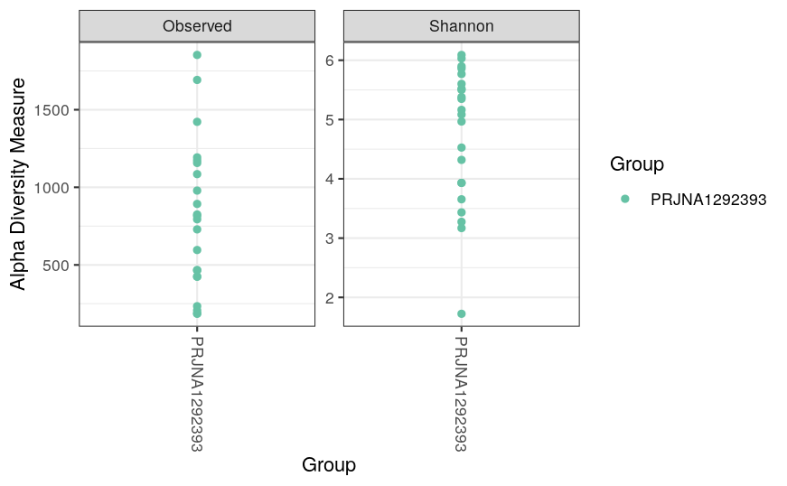

Cette vérification détecte la présence de valeurs manquantes dans la table d’abondance, qui pourraient provoquer des erreurs ou biaiser certaines analyses si elles ne sont pas traitées.

```{r}
any(is.na(otu_table(ps)))

```

On retire les échantillons sans lectures (0 reads), car ils ne contiennent aucune information microbiologique exploitable et peuvent faire échouer certaines fonctions d’ordination/diversité.

```{r}
ps <- prune_samples(sample_sums(ps) > 0, ps)

```

On filtre ensuite les échantillons à faible profondeur (<1000 reads) afin de limiter les biais liés au sous-échantillonnage et rendre les comparaisons entre échantillons plus robustes.

```{r}
ps <- prune_samples(sample_sums(ps) >= 1000, ps)

```

On transforme les abondances en proportions (abondances relatives) pour comparer des profils indépendamment de la profondeur totale, ce qui est particulièrement adapté aux distances de type Bray-Curtis et aux visualisations de composition.*

```{r}
ps.prop <- transform_sample_counts(ps, function(x) x / sum(x))

```

Cette section réalise une ordination NMDS basée sur Bray-Curtis afin de visualiser la similarité de composition entre échantillons : des points proches ont des communautés similaires, et la coloration par BioProject aide à repérer une structuration par groupe.

```{r}
# Transform data to proportions as appropriate for Bray-Curtis distances
ps.prop <- transform_sample_counts(ps, function(otu) otu/sum(otu))
ord.nmds.bray <- ordinate(ps.prop, method="NMDS", distance="bray")
```

Diversité beta :

L’ordination NMDS basée sur la distance de Bray-Curtis montre une dispersion des échantillons dans l’espace ordonné, traduisant une hétérogénéité de la composition microbienne entre les différents sites étudiés. L’absence de regroupement strict suggère que la structure des communautés varie en fonction de facteurs locaux, tels que la source de l’eau, les caractéristiques du réseau de distribution ou les conditions environnementales. Ces résultats confirment que les communautés microbiennes de l’eau potable ne sont pas homogènes à grande échelle.


```{r}
plot_ordination(ps.prop, ord.nmds.bray, color="BioProject", title="Bray NMDS")
```

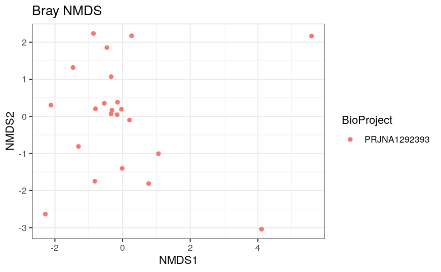

Ce bloc résume le nombre d’échantillons et la distribution des profondeurs de séquençage, puis vérifie explicitement la présence d’échantillons à 0 reads (idéalement aucun après filtrage), afin de valider la cohérence de l’objet phyloseq.

```{r}
nsamples(ps)
summary(sample_sums(ps))

# combien ont 0 reads ?
sum(sample_sums(ps) == 0)

# si tu travailles avec ps.prop :
nsamples(ps.prop)
sum(sample_sums(ps.prop) == 0)

```

On liste les variables disponibles dans les métadonnées intégrées à phyloseq, ce qui aide à choisir les facteurs de coloration, de regroupement ou de comparaison statistique pour les analyses downstream.

```{r}
sample_variables(ps)

# ou
colnames(as.data.frame(sample_data(ps)))

```

 [1] "Assay.Type"                     "AvgSpotLen"                    
 [3] "Bases"                          "BioProject"                    
 [5] "BioSample"                      "BioSampleModel"                
 [7] "Bytes"                          "Center.Name"                   
 [9] "Collection_Date"                "Consent"                       
[11] "DATASTORE.filetype"             "DATASTORE.provider"            
[13] "DATASTORE.region"               "Depth"                         
[15] "env_broad_scale"                "env_local_scale"               
[17] "env_medium"                     "Experiment"                    
[19] "geo_loc_name_country"           "geo_loc_name_country_continent"
[21] "geo_loc_name"                   "Instrument"                    
[23] "lat_lon"                        "Library.Name"                  
[25] "LibraryLayout"                  "LibrarySelection"              
[27] "LibrarySource"                  "Organism"                      
[29] "Platform"                       "ReleaseDate"                   
[31] "create_date"                    "version"                       
[33] "Sample.Name"                    "SRA.Study"                     
[35] "Group"                         
 [1] "Assay.Type"                     "AvgSpotLen"                    
 [3] "Bases"                          "BioProject"                    
 [5] "BioSample"                      "BioSampleModel"                
 [7] "Bytes"                          "Center.Name"                   
 [9] "Collection_Date"                "Consent"                       
[11] "DATASTORE.filetype"             "DATASTORE.provider"            
[13] "DATASTORE.region"               "Depth"                         
[15] "env_broad_scale"                "env_local_scale"               
[17] "env_medium"                     "Experiment"                    
[19] "geo_loc_name_country"           "geo_loc_name_country_continent"
[21] "geo_loc_name"                   "Instrument"                    
[23] "lat_lon"                        "Library.Name"                  
[25] "LibraryLayout"                  "LibrarySelection"              
[27] "LibrarySource"                  "Organism"                      
[29] "Platform"                       "ReleaseDate"                   
[31] "create_date"                    "version"                       
[33] "Sample.Name"                    "SRA.Study"                     
[35] "Group"              

Composition taxonomique :

Quels sont les groupes bactériens dominants ?

L’analyse de la composition taxonomique révèle une dominance des phyla Proteobacteria, Bacteroidota et Actinobacteriota, fréquemment retrouvés dans les environnements aquatiques et les réseaux d’eau potable. À des niveaux taxonomiques plus fins, plusieurs genres comprenant des bactéries pathogènes opportunistes, tels que Escherichia, Acinetobacter, Legionella et Mycobacterium, ont été détectés. Ces résultats sont cohérents avec ceux rapportés dans l’article et soulignent l’intérêt du métabarcoding pour la détection simultanée de bactéries environnementales et de pathogènes potentiels.

Cette étape sélectionne les 20 ASV les plus abondants globalement, les convertit en abondances relatives et produit des barplots, ce qui permet de visualiser rapidement les taxa dominants et leur variation selon l’échantillon ou une variable expérimentale.

```{r}
top20 <- names(sort(taxa_sums(ps), decreasing=TRUE))[1:20]
ps.top20 <- transform_sample_counts(ps, function(OTU) OTU/sum(OTU))
ps.top20 <- prune_taxa(top20, ps.top20)
plot_bar(ps.top20, x="Collection_Date", fill="Family") 
```

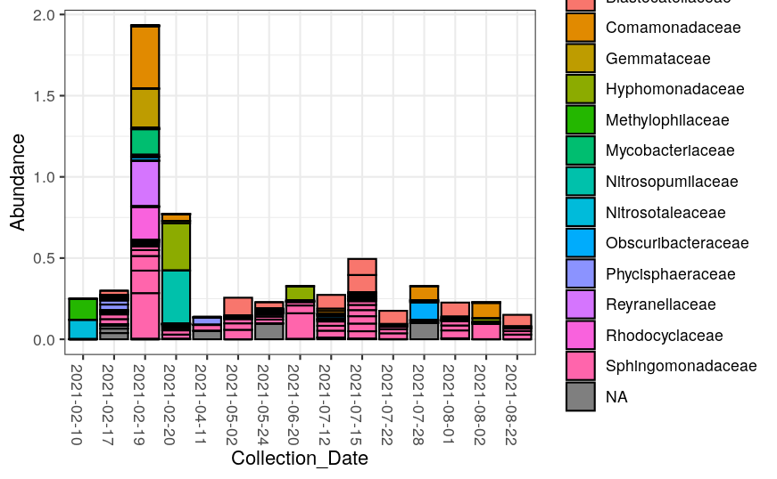

Ces graphiques comparent la composition taxonomique des échantillons (ici les top ASV) à différents niveaux (phylum, family, genus, species), afin d’obtenir une lecture multi-échelle de la structure des communautés et repérer des profils typiques ou des différences entre échantillons.

```{r}
plot_bar(ps.top20, x = "BioSample", fill = "Phylum")
```

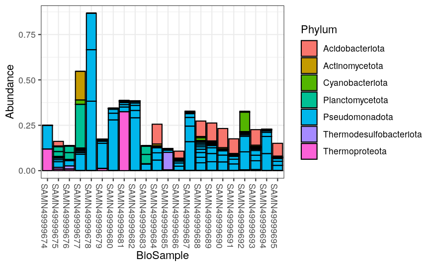

```{r}
plot_bar(ps.top20, x = "BioSample", fill = "Family")

```

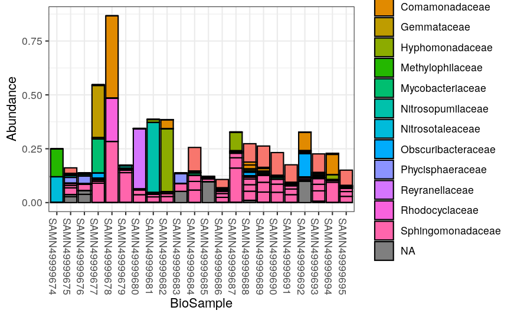

```{r}
plot_bar(ps.top20, x = "BioSample", fill = "Genus")
```


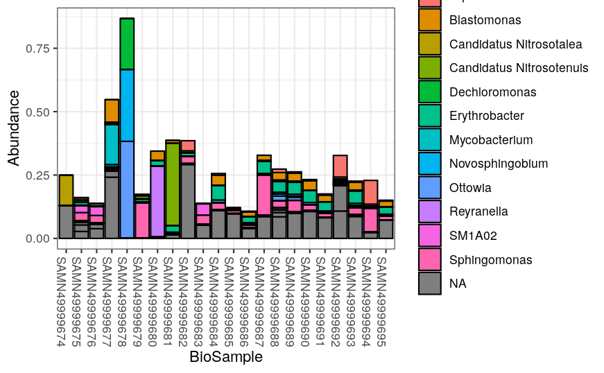

```{r}
plot_bar(ps.top20, x = "BioSample", fill = "Species")
```

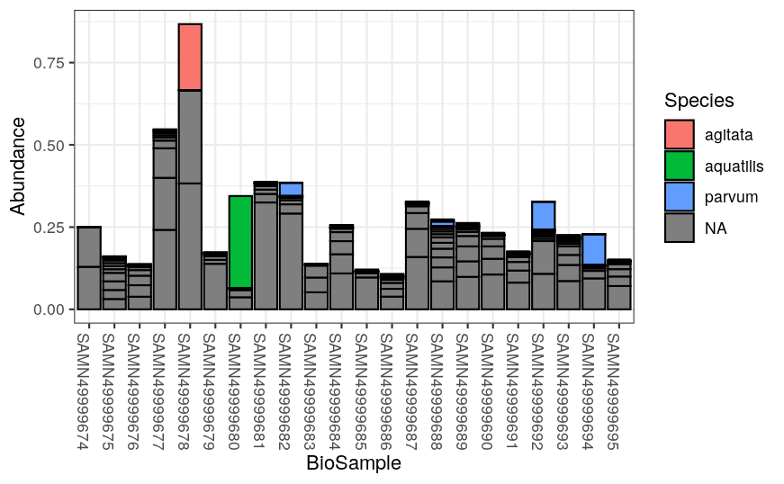


```{r}
Path <- "~/Analyse/phylum_ra_rt.csv"

```


```{r}
a <- read.csv("~/Analyse/phylum_ra_rt.csv")

library(dplyr)
library(ggplot2)
library(reshape2)
library(RColorBrewer)

b <- t(a)
colnames(b) <- b[1,]
d <- b[-1,]

dt <- as.data.frame(d)
dt[,1] <- as.numeric(dt[,1])
od <- dt[order(dt[,1]),]

od[,3:14] <- as.numeric(unlist(od[,3:14]))
rownames(od) <- od[,2]
gg <- od[,-1]

gg$sa <- factor(gg$sa, levels = gg$sa)

mt <- melt(data = gg, id.vars = "sa",
           variable.name = "Phylum", value.name = "level")

mt$RA <- 100 * as.numeric(mt$level)

palette3 <- brewer.pal(1,"Set3")
palette0 <- brewer.pal(11,"Paired")
big_palette <- c(palette0, palette3)

pth <- ggplot(mt, aes(x = sa, y = RA, fill = Phylum)) + 
  geom_col(position = "stack", width = 0.6) +
  theme_bw()

pth

```


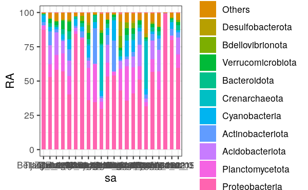

```{r}
Path <- "~/Analyse/corpthasv2025.csv"

```

Corrélations entre diversité et pathogènes
Existe-t-il un lien entre diversité microbienn
e et abondance de pathogènes ?

L’analyse de corrélation met en évidence des relations positives entre les indices de diversité microbienne et l’abondance de certains pathogènes. Cela suggère que les échantillons présentant une plus grande diversité bactérienne peuvent également contenir davantage de pathogènes opportunistes. Toutefois, ces résultats doivent être interprétés avec prudence, car la détection d’ADN ne permet pas de distinguer les bactéries vivantes des bactéries mortes ni d’évaluer leur potentiel infectieux réel.

```{r}
library(corrplot)

p <- read.csv("~/Analyse/corpthasv2025.csv")

# Colonnes numériques
pnum <- p[, 2:12]

# Corrélations
p.cor <- cor(pnum, method = "spearman")

# p-values : IMPORTANT -> il faut cor.mtest(pnum), pas cor.mtest(p.cor)
test <- cor.mtest(pnum)

# Ordre personnalisé
custom_order <- c(
  "Chao1", "Shannon", "Escherichia.coli", "Acinetobacter", "Salmonella",
  "Legionella", "Leptospira", "Aeromonas", "Mycobacterium", "Brevundimonas", "Pathogen"
)

# Réordonner AVANT le plot
p.cor <- p.cor[custom_order, custom_order]
test$p <- test$p[custom_order, custom_order]

# Ouvrir le PDF (dans le dossier courant)
pdf("corasv_spear.pdf", width = 10, height = 10)

corrplot.mixed(
  p.cor,
  lower = "number",
  upper = "circle",
  p.mat = test$p,
  sig.level = c(0.001, 0.01, 0.05),
  insig = "label_sig",      # met des symboles pour non significatif
  pch.cex = 1,
  pch.col = "grey20",
  order = "original",
  tl.pos = "lt",
  tl.col = "black",
  tl.cex = 1,
  number.cex = 1,
  upper.col = colorRampPalette(c("dodgerblue4", "white", "red3"))(200),
  lower.col = colorRampPalette(c("dodgerblue4", "white", "red3"))(200)
)

dev.off()
```


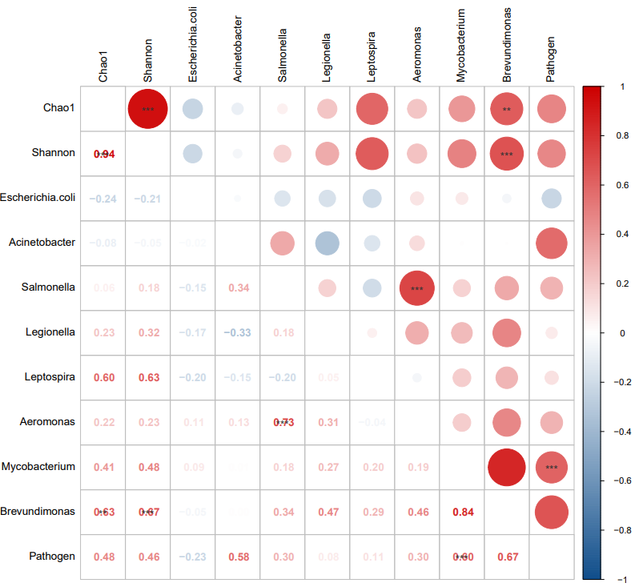

Discussion et conclusion :

Dans l’ensemble, les résultats obtenus confirment les conclusions de l’article étudié, montrant que l’eau potable domestique abrite des communautés microbiennes diversifiées et parfois des pathogènes opportunistes. L’approche de métabarcoding utilisée constitue un outil puissant pour la surveillance microbiologique de l’eau, bien qu’elle présente certaines limites liées à l’absence d’information sur la viabilité bactérienne. Néanmoins, cette méthode offre une vision globale de la diversité microbienne et pourrait compléter les méthodes traditionnelles de contrôle sanitaire, notamment dans le cadre de programmes de surveillance à grande échelle.

